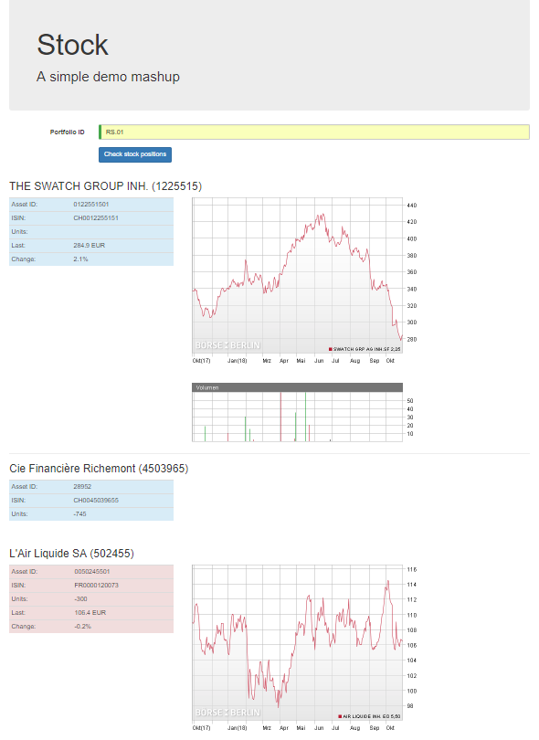

# Open API Demo App

A simple example of a mashup web app, combining the data from an Avaloq Open API with external data.  

## Installation ##

1. You need to have Node.js installed on your machine. You can request this from the Software Kiosk.
2. Install Angular if necessary
```npm install -g @angular/cli@latest```
3. If using the corporate proxy make sure angular.json references `proxy.conf.js`
4. If using a sandbox edit `proxy.conf.js` to point to the sandbox URL
5. Build the app using `npm update`
6. To start the application execute either
`ng serve --configuration=sandbox`
, or 
`ng serve --configuration=testbed`
and then access `http://127.0.0.1:4200/` in your browser.

When using the testbed the app builds the required JWT token itself.  For the sandbox it will prompt you for a token when necessary, e.g. the token it has cached has expired.

This project was generated with [Angular CLI](https://github.com/angular/angular-cli) version 7.0.3.


